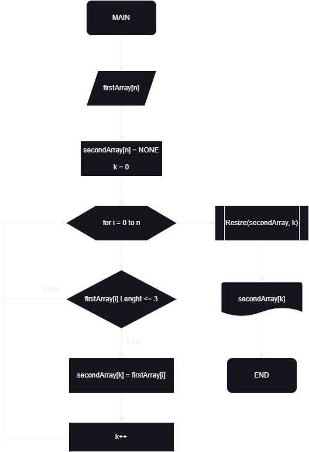

# C-sharpControlWork

## Задача:
Написать программу, которая из имеющегося массива строк формирует новый массив из строк, длина которых меньше, либо равна 3 символам. Первоначальный массив можно ввести с клавиатуры, либо задать на старте выполнения алгоритма. При решении не рекомендуется пользоваться коллекциями, лучше обойтись исключительно массивами.

## Примеры:
* [“Hello”, “2”, “world”, “:-)”] → [“2”, “:-)”]
* [“1234”, “1567”, “-2”, “computer science”] → [“-2”]
* [“Russia”, “Denmark”, “Kazan”] → []

## Решение:
Для решения данной задачи мною был разработан алгоритм.

Блок схема алгоритма:

1. Пользователь задает массив из ***n*** элементов.
2. Объявляем пустой массив, куда будем записывать значения, удовлетворяющие условию задачи.
3. Необходимо также объявить инкремент ***k***. Эта переменная будет хранить информацию о том, сколько раз значения из первого иходного массива были перенесены во второй массив. Также ***k*** будет служить индексом для втрого массива.
4. Запускаем цикл **for**, в котором инкремент ***i*** будет проходить по всему исходному массиву с шагом 1.
5. Таким образом, получаем массив с элементами, удовлетворяющими условию задачи, но по прежнему размерности ***n***.
6. С помощью метода **Resize** "отсекаем лишнее" от массива.
7. Выводим на дисплей второй искомый массив размерностью ***k***.