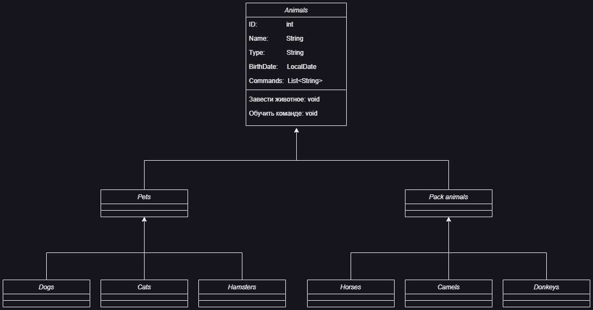

# FinalControlWorkSpecializationBlock

## Информация о проекте
Необходимо организовать систему учета для питомника в котором живут
домашние и вьючные животные.
## Как сдавать проект
Для сдачи проекта необходимо создать отдельный общедоступный
репозиторий(Github, gitlub, или Bitbucket). Разработку вести в этом
репозитории, использовать пул реквесты на изменения. Программа должна
запускаться и работать, ошибок при выполнении программы быть не должно.
Программа, может использоваться в различных системах, поэтому необходимо
разработать класс в виде конструктора
## Задание
1. Используя команду cat в терминале операционной системы Linux, создать
два файла Домашние животные (заполнив файл собаками, кошками,
хомяками) и Вьючные животными заполнив файл Лошадьми, верблюдами и
ослы, а затем объединить их. Просмотреть содержимое созданного файла.
Переименовать файл, дав ему новое имя (Друзья человека).
```
petr@petr82:~/control-work$ cat > Pets
Собаки, кошки и хомяки
petr@petr82:~/control-work$ cat > 'Pack animals'
Лошади, верблюды и ослы
petr@petr82:~/control-work$ cat Pets 'Pack animals' > file
petr@petr82:~/control-work$ cat file
Собаки, кошки и хомяки
Лошади, верблюды и ослы
petr@petr82:~/control-work$ mv file 'Human Friends'
petr@petr82:~/control-work$ ls
'Human Friends'  'Pack animals'   Pets
```
2. Создать директорию, переместить файл туда.
```
petr@petr82:~/control-work$ mkdir human-friends
petr@petr82:~/control-work$ mv 'Human Friends' human-friends/
petr@petr82:~/control-work$ tree
.
├── human-friends
│   └── Human Friends
├── Pack animals
└── Pets

1 directory, 3 files
```
3. Подключить дополнительный репозиторий MySQL. Установить любой пакет
из этого репозитория.
```
petr@petr82:~/control-work$ sudo apt install mysql-server
petr@petr82:~/control-work$ wget https://dev.mysql.com/get/mysql-apt-config_0.8.12-1_all.deb
petr@petr82:~/control-work$ sudo apt install ./mysql-apt-config_0.8.12-1_all.deb
petr@petr82:~/control-work$ sudo apt update
petr@petr82:~/control-work$ sudo apt install -f mysql-client=8.0* mysql-server=8.0*
petr@petr82:~/control-work$ sudo mysql_secure_installation
```
4. Установить и удалить deb-пакет с помощью dpkg.
```
petr@petr82:~/control-work$ sudo apt download lftp
petr@petr82:~/control-work$ sudo dpkg -i lftp_4.9.2-1build1_amd64.deb
petr@petr82:~/control-work$ sudo dpkg -r lftp
```
5. Выложить историю команд в терминале ubuntu
6. Нарисовать диаграмму, в которой есть класс родительский класс, домашние
животные и вьючные животные, в составы которых в случае домашних
животных войдут классы: собаки, кошки, хомяки, а в класс вьючные животные
войдут: Лошади, верблюды и ослы.

7. В подключенном MySQL репозитории создать базу данных “Друзья
человека”
8. Создать таблицы с иерархией из диаграммы в БД
9. Заполнить низкоуровневые таблицы именами(животных), командами
которые они выполняют и датами рождения

Лист "Pets"
| ID | Name     | Type	  | BirthDate	 | Commands             |
|----|----------|---------|------------|----------------------|
| 1	 | Fido	    | Dog	    | 2020-01-01 | Sit, Stay, Fetch     |
| 2  | Whiskers	| Cat	    | 2019-05-15 | Sit, Pounce          |
| 3	 | Hammy	  | Hamster	| 2021-03-10 | Roll, Hide           |
| 4	 | Buddy	  | Dog	    | 2018-12-10 | Sit, Paw, Bark       |
| 5	 | Smudge	  | Cat	    | 2020-02-20 | Sit, Pounce, Scratch |
| 6	 | Peanut	  | Hamster	| 2021-08-01 | Roll, Spin           |
| 7	 | Bella	  | Dog	    | 2019-11-11 | Sit, Stay, Roll      |
| 8	 | Oliver	  | Cat	    | 2020-06-30 | Meow, Scratch, Jump  |

 Лист "PackAnimals"
| ID | Name     | Type	  | BirthDate	 | Commands               |
|----|----------|---------|------------|------------------------|
| 1	 | Thunder  | Horse   | 2015-07-24 | Trot, Canter, Gallop   |
| 2  | Sandy  	| Camel   | 2016-11-03 | Walk, Carry Load       |
| 3	 | Eeyore	  | Donkey	| 2017-09-18 | Walk, Carry Load, Bray |
| 4	 | Storm	  | Horse   | 2014-05-05 | Trot, Canter           |
| 5	 | Dune 	  | Camel   | 2018-12-12 | Walk, Sit              |
| 6	 | Burro	  | Donkey	| 2019-01-23 | Walk, Bray, Kick       |
| 7	 | Blaze	  | Horse   | 2016-02-29 | Trot, Jump, Gallop     |
| 8	 | Sahara	  | Camel   | 2015-08-14 | Walk, Run              |
10. Удалив из таблицы верблюдов, т.к. верблюдов решили перевезти в другой
питомник на зимовку. Объединить таблицы лошади, и ослы в одну таблицу.
11. Создать новую таблицу “молодые животные” в которую попадут все
животные старше 1 года, но младше 3 лет и в отдельном столбце с точностью
до месяца подсчитать возраст животных в новой таблице
12. Объединить все таблицы в одну, при этом сохраняя поля, указывающие на
прошлую принадлежность к старым таблицам.
13. Создать класс с Инкапсуляцией методов и наследованием по диаграмме.
14. Написать программу, имитирующую работу реестра домашних животных.

      В программе должен быть реализован следующий функционал:

      14.1. Завести новое животное

      14.2 определять животное в правильный класс

      14.3 увидеть список команд, которое выполняет животное

      14.4 обучить животное новым командам

      14.5 Реализовать навигацию по меню

15. Создайте класс Счетчик, у которого есть метод add(), увеличивающий̆
значение внутренней̆int переменной̆на 1 при нажатие “Завести новое
животное” Сделайте так, чтобы с объектом такого типа можно было работать в
блоке try-with-resources. Нужно бросить исключение, если работа с объектом
типа счетчик была не в ресурсном try и/или ресурс остался открыт. Значение
считать в ресурсе try, если при заведения животного заполнены все поля.